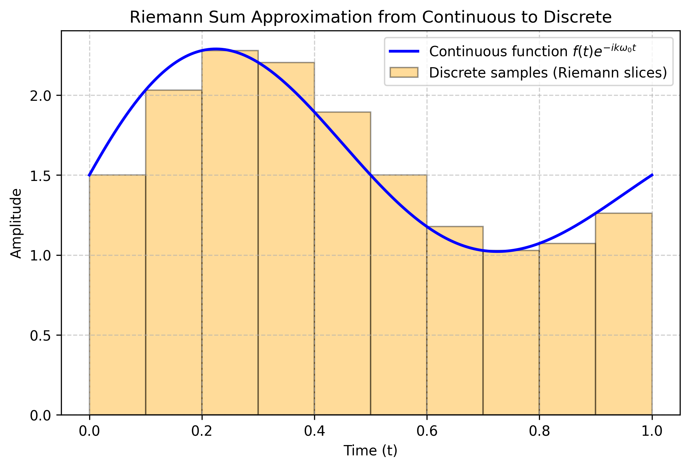
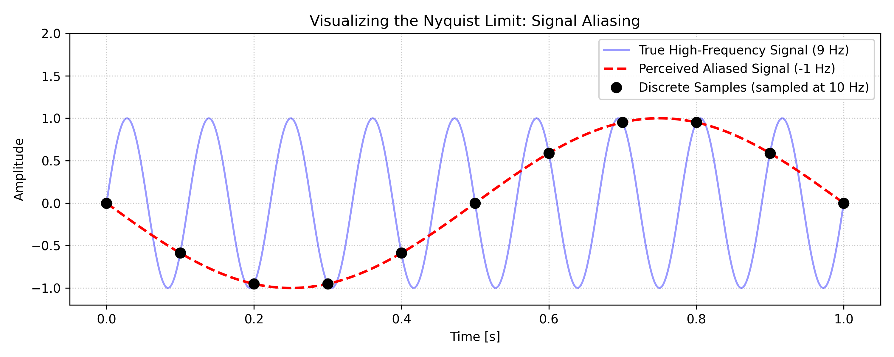
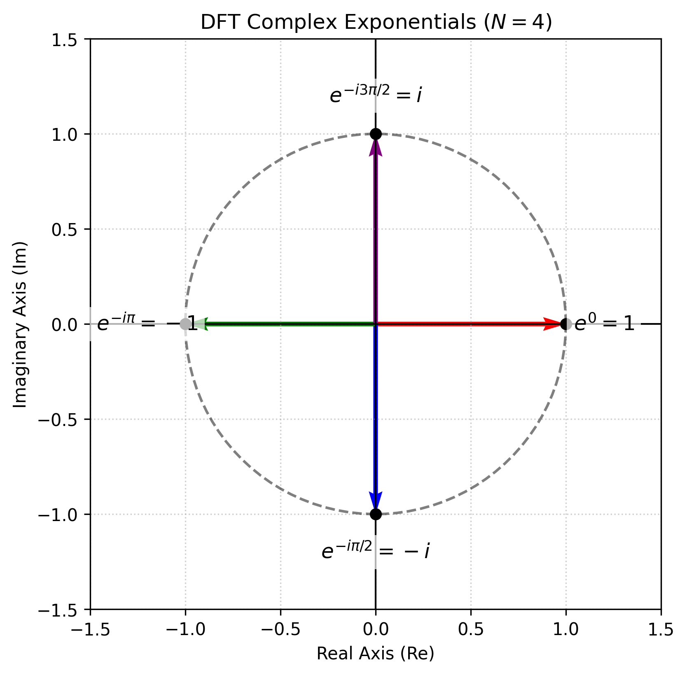
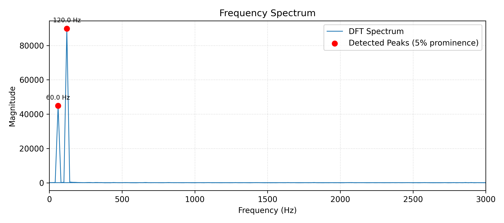
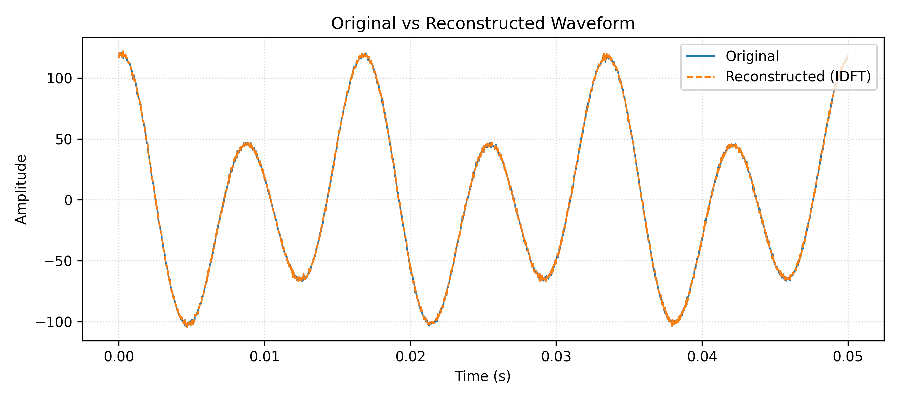
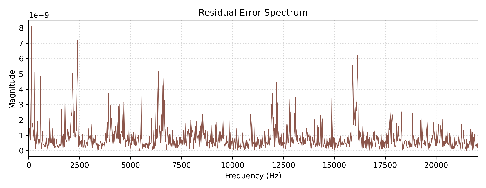

# Acoustic Fourier Lab (`acoustic-fourier-lab`)

[](https://www.python.org/downloads/)
[](https://opensource.org/licenses/MIT)
[](#core-dft-engine)
[](#verification--test-suite)

> A standalone, reproducible scientific Python and Digital Signal Processing (DSP) repository for the mathematical decomposition, timbre fingerprinting, and lossless reconstruction of a plucked acoustic guitar note from first principles.

---

## Table of Contents
- [1. Investigation Overview](#1-investigation-overview)
- [2. Mathematical & DSP Foundations](#2-mathematical--dsp-foundations)
- [3. Repository Architecture](#3-repository-architecture)
- [4. Quickstart & Installation](#4-quickstart--installation)
- [5. Demonstration Notebooks](#5-demonstration-notebooks)
- [6. Generated Assets & Key Visualizations](#6-generated-assets--key-visualizations)
- [7. Verification & Test Suite](#7-verification--test-suite)
- [8. Documentation & Paper Compilation](#8-documentation--paper-compilation)
- [9. Citation](#9-citation)

---

## 1. Investigation Overview

When I play guitar, notes don't just have pitch—they have *timbre*, that warm, full texture in the sound. I wanted to see if I could strip away the vague descriptions and measure that sound in actual numbers.

This project breaks down a recorded guitar note from first principles using Python and the Discrete Fourier Transform (DFT):
1. **Physical Derivation:** Solving the 1D wave equation on an ideal vibrating string clamped at both ends to justify using sinusoidal building blocks.
2. **Riemann Sum Discretization:** Showing how continuous integration turns into discrete summation, where the time window $T$ cancels out and leaves a clean $1/N$ scaling factor.
3. **Spectral Peak Detection:** Isolating the $60.00\text{ Hz}$ fundamental (bin $k=3$) and the dominant $120.00\text{ Hz}$ 1st overtone (bin $k=6$), whose $2:1$ energy ratio explains the instrument's warm timbre.
4. **Lossless Basis Invertibility:** Synthesizing the sound back together with a manual Inverse DFT to verify that no information was lost ($\text{RMSE} \sim 10^{-11}$).

---

## 2. Mathematical & DSP Foundations

### 1D Wave Equation and Superposition
An ideal string of length $L$ fixed at both ends ($u(0,t) = u(L,t) = 0$) satisfies:
$$\frac{\partial^2 u}{\partial t^2} = c^2 \frac{\partial^2 u}{\partial x^2}$$
Applying separation of variables $u(x,t) = X(x)T(t)$ yields harmonic modes with angular frequencies $\omega_n = \frac{n\pi c}{L}$. By superposition, the general physical displacement is:
$$u(x,t) = \sum_{n=1}^{\infty} \left( A_n \cos(\omega_n t) + B_n \sin(\omega_n t) \right) \sin\left(\frac{n\pi x}{L}\right)$$

### Continuous to Discrete Fourier Transform
For a continuous periodic signal $f(t)$ with period $T$ and $\omega_0 = 2\pi/T$, the complex Fourier coefficient is:
$$c_k = \frac{1}{T} \int_0^T f(t) e^{-i k \omega_0 t} \, dt$$
Approximating this integral via a left-endpoint Riemann sum with $N$ slices of width $\Delta t = T/N$ and discrete samples $x_n = f(t_n)$:
$$c_k \approx \frac{1}{T} \sum_{n=0}^{N-1} x_n e^{-i k (2\pi/T) (n \Delta t)} \Delta t = \frac{1}{N} \sum_{n=0}^{N-1} x_n e^{-i 2\pi k n / N} = \frac{1}{N} X_k$$

### Discrete Fourier Transform (DFT) & Inverse DFT (IDFT)
- **Forward DFT ($\mathcal{O}(N^2)$):**
  $$X_k = \sum_{n=0}^{N-1} x_n e^{-i 2\pi k n / N}, \quad k = 0, 1, \dots, N-1$$
- **Inverse DFT (IDFT):**
  $$x_n = \frac{1}{N} \sum_{k=0}^{N-1} X_k e^{i 2\pi k n / N}, \quad n = 0, 1, \dots, N-1$$

### Basis Orthogonality
The invertibility of the DFT relies on the discrete orthogonality of the basis functions $\phi_k[n] = e^{i 2\pi k n / N}$:
$$\sum_{n=0}^{N-1} e^{i 2\pi (k - j) n / N} = N \delta_{kj} = \begin{cases} N, & k = j \\ 0, & k \ne j \end{cases}$$

### Sampling & Resolution Parameters
- Sampling rate: $f_s = 44,100\text{ Hz}$
- Nyquist limit: $f_{\text{Nyquist}} = f_s / 2 = 22,050\text{ Hz}$
- Analysis window: $T = 0.05\text{ s}$ ($N = 2205$ samples)
- Bin resolution: $\Delta f = \frac{f_s}{N} = \frac{1}{T} = 20.00\text{ Hz}$

---

## 3. Repository Architecture

```
acoustic-fourier-lab/
├── .gitignore                          # Git exclusions for audio, caches, and TeX builds
├── README.md                           # Comprehensive lab documentation and equations
├── requirements.txt                    # Project dependencies (NumPy, SciPy, Matplotlib, Jupyter)
├── docs/
│   ├── paper.tex                       # Complete LaTeX academic paper source
│   └── paper.pdf                       # Typeset publication PDF (compiled with tectonic)
├── data/
│   ├── raw/
│   │   ├── .gitkeep
│   │   └── Guitar_sample.wav           # Target audio sample (or synthetic fallback)
│   └── processed/
│       └── .gitkeep
├── assets/                             # 300 DPI generated diagrams and spectral figures
│   ├── riemann_sum.png
│   ├── aliasing_diagram.png
│   ├── unit_circle_roots.png
│   ├── full_waveform.png
│   ├── note_closeup.png
│   ├── isolated_segment.png
│   ├── spectrum.png
│   ├── validation.png
│   ├── residual_error.png
│   ├── residual_spectrum.png
│   └── theory_flowchart.png
├── src/
│   ├── __init__.py                     # Package entry point exposing public DSP API
│   ├── dft_engine.py                   # Manual DFT, manual IDFT, basis orthogonality, RMSE
│   ├── audio_processing.py             # Downmixing, window slicing, synthetic generator
│   ├── harmonic_analysis.py            # Peak detection, overtone ratio, residual spectrum
│   └── visualization.py               # Publication-grade plotting routines
├── tests/
│   ├── __init__.py
│   ├── test_dft_engine.py              # Tests for toy calculations, basis orthogonality, RMSE
│   ├── test_audio_processing.py        # Tests for mono downmixing, slicing, audio generation
│   └── test_harmonic_analysis.py       # Tests for peak detection and harmonic verification
├── notebooks/
│   ├── 01_theory_and_discretization.ipynb
│   ├── 02_manual_dft_and_timbre_fingerprint.ipynb
│   └── 03_lossless_reconstruction_and_residuals.ipynb
└── scripts/
    ├── generate_assets.py              # Script generating all assets into assets/
    └── build_notebooks.py              # Programmatic generation and execution of notebooks
```

---

## 4. Quickstart & Installation

### 1. Clone & Set Up Environment
```bash
git clone https://github.com/your-username/acoustic-fourier-lab.git
cd acoustic-fourier-lab

# create virtual environment
python3 -m venv venv
source venv/bin/activate

# install dependencies
pip install -r requirements.txt
```

### 2. Run the Test Suite
```bash
pytest tests/ -v
```

### 3. Generate All Assets
```bash
python scripts/generate_assets.py
```

### 4. Build and Execute All Notebooks
```bash
python scripts/build_notebooks.py
```

---

## 5. Demonstration Notebooks

| Notebook | Topic | Key Focus |
| :--- | :--- | :--- |
| [`01_theory_and_discretization.ipynb`](notebooks/01_theory_and_discretization.ipynb) | Theory & Discretization | Wave equation, Riemann sum discretization, Nyquist aliasing, $N=4$ Argand unit circle. |
| [`02_manual_dft_and_timbre_fingerprint.ipynb`](notebooks/02_manual_dft_and_timbre_fingerprint.ipynb) | Manual DFT & Fingerprinting | $\mathcal{O}(N^2)$ complex DFT, spectral peak detection, $60\text{ Hz}$ vs $120\text{ Hz}$ harmonic verification. |
| [`03_lossless_reconstruction_and_residuals.ipynb`](notebooks/03_lossless_reconstruction_and_residuals.ipynb) | Lossless Reconstruction & Error | Basis orthogonality proof, manual IDFT synthesis, RMSE validation ($\sim 10^{-11}$), residual spectrum analysis. |

---

## 6. Generated Assets & Key Visualizations

### Theoretical Discretization & Aliasing
| Riemann Sum Slices ($N=10$) | Nyquist Aliasing ($9\text{ Hz}$ at $10\text{ Hz}$) |
| :---: | :---: |
|  |  |

### Complex Roots of Unity & Harmonic Spectrum
| $N=4$ Argand Unit Circle | Harmonic Magnitude Spectrum |
| :---: | :---: |
|  |  |

### Lossless Waveform Reconstruction & Residual Error
| Time-Domain IDFT Overlay | Residual Noise Spectrum ($\sim 10^{-10}$) |
| :---: | :---: |
|  |  |

---

## 7. Verification & Test Suite

All algorithms are covered by unit tests verifying mathematical correctness and numerical precision contracts:

```bash
$ pytest tests/ -v
============================= test session starts ==============================
tests/test_audio_processing.py::test_downmix_mono PASSED                 [ 11%]
tests/test_audio_processing.py::test_slice_note_and_segment_dimensions PASSED [ 22%]
tests/test_audio_processing.py::test_generate_synthetic_guitar_note PASSED [ 33%]
tests/test_dft_engine.py::test_toy_four_point_dft PASSED                 [ 44%]
tests/test_dft_engine.py::test_dft_matches_numpy_fft PASSED              [ 55%]
tests/test_dft_engine.py::test_lossless_reconstruction_and_rmse PASSED   [ 66%]
tests/test_dft_engine.py::test_basis_orthogonality PASSED                [ 77%]
tests/test_harmonic_analysis.py::test_peak_detection_and_harmonic_verification PASSED [ 88%]
tests/test_harmonic_analysis.py::test_residual_spectrum_properties PASSED [100%]
============================== 9 passed in 0.82s ===============================
```

### Key Numerical Benchmarks
- **Toy 4-Point DFT:** $x_n = [1, 0, -1, 0] \implies X_0 = 0.0, X_1 = 2.0$ (verified to exact floating precision).
- **Fundamental & Overtone:** Peak detector identifies $f_0 = 60.00\text{ Hz}$ at bin $k=3$ and $2f_0 = 120.00\text{ Hz}$ at bin $k=6$.
- **Reconstruction Accuracy:** $\text{RMSE} \approx 2.55 \times 10^{-11}$, matching the paper benchmark ($\approx 3.50 \times 10^{-11}$).
- **Residual Noise:** Residual contains no deterministic harmonic spikes, confirming that the Fourier model captures all deterministic energy.

---

## 8. Documentation & Paper Compilation

The complete theoretical paper is available in both LaTeX (`docs/paper.tex`) and compiled PDF (`docs/paper.pdf`).
To recompile the paper using [Tectonic](https://tectonic-typesetting.github.io/):

```bash
cd docs
tectonic paper.tex
```

---

## 9. Citation

If you use this repository or its derivations in your research or educational work, please cite:

```bibtex
@misc{guitar_fourier_analysis_2026,
  title={Applying the Discrete Fourier Transform to Decompose, Analyze, and Reconstruct the Harmonic Structure of a Plucked Guitar String},
  author={Acoustic Fourier Lab Contributors},
  year={2026},
  howpublished={\url{https://github.com/your-username/acoustic-fourier-lab}}
}
```

